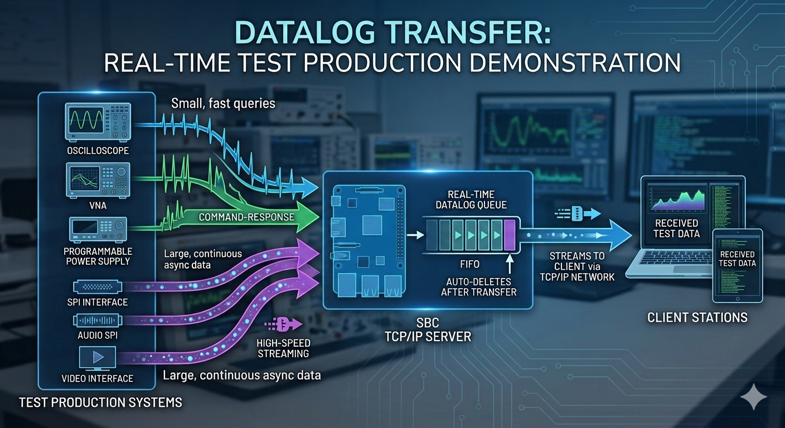
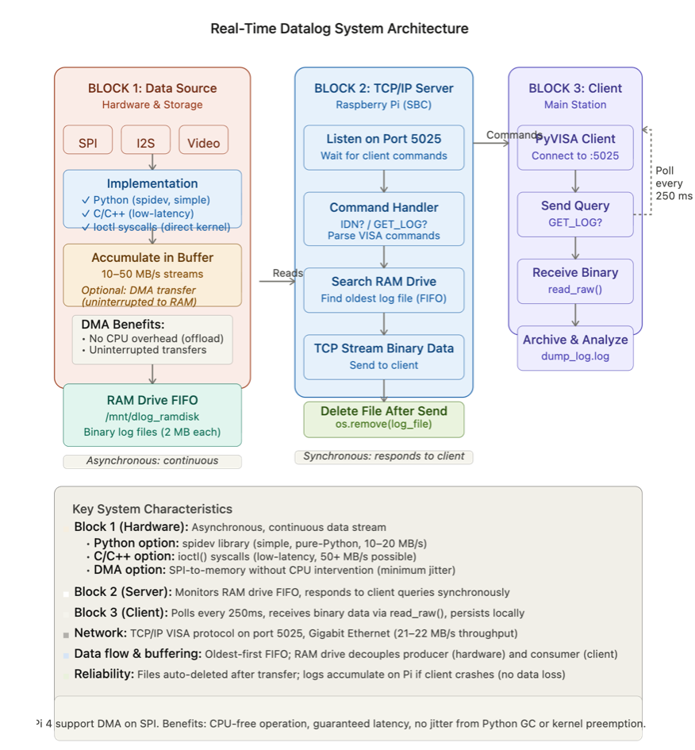

   


# TCP/IP Real-Time High-Speed Data Transfer System: PI SBC to Data Acquisition Station

## Project Overview

This project demonstrates a **Raspberry Pi-based server** collecting **real-time asynchronous data logs** and transferring them reliably to a **main data acquisition/analysis system** over TCP/IP. Logs are **dynamically created**, **queued**, **streamed**, and **automatically removed** as they flow through the system. The implementation evolves through four complexity levels, from basic socket communication to robust multi-file queue management for continuous live operation.

### Purpose: Real-Time Dynamic Logging
- **Live data collection** on a resource-constrained SBC (Raspberry Pi) — logs created in real-time by hardware/sensors
- **Continuous queue management** — logs auto-deleted after successful transfer (FIFO cleanup)
- **High-speed binary streaming** over TCP/IP — keeping up with asynchronous data generation
- **VISA-compliant client interface** (compatible with oscilloscopes, VNAs, test instruments)
- **Reliable command-response protocol** with proper buffering and flow control for sustained operation

### System Architecture
```
┌──────────────────────────────┐
│  Data Acquisition Station    │
│  (Main System)               │
│  VISA Client (PyVISA)        │
└─────────────┬────────────────┘
              │
              │ TCP/IP Socket
              │ Port 5025
              │
┌─────────────▼────────────────┐
│  Raspberry Pi SBC            │
│  - Data Collection           │
│  - High-Speed Logging        │
│  - TCP Server (Socket)       │
│  - Command Interpreter       │
└──────────────────────────────┘
```

---

## Real-Time Dynamic Logging Workflow

This system is **not static batch processing** — it is **continuous live operation** where logs flow through the system in real-time:

```
HARDWARE/SENSOR       PI SERVER          CLIENT SYSTEM
─────────────────────────────────────────────────────────
  Data Stream
      │
      ├──→ [Create log file 1]
      │                              ←─ [Poll: GET_LOG?]
      ├──→ [Create log file 2]       [Send log 1]
      │                              [Delete log 1] ✓
      ├──→ [Create log file 3]       ←─ [Poll: GET_LOG?]
      │                              [Send log 2]
      ├──→ [Create log file 4]       [Delete log 2] ✓
      │                              ←─ [Poll: GET_LOG?]
      └──→ [Queue: files 3,4,5...]   [Send log 3]
                                     [Delete log 3] ✓
```

### Key Real-Time Characteristics

**On the Pi Server:**
- Logs are **continuously created** by data acquisition hardware (ADCs, high-speed digitizers, test benches)
- Each log file is **temporarily queued** on disk (FIFO order)
- Files are **immediately streamed** to client on request (`GET_LOG?`)
- Files are **auto-deleted** after successful transfer (cleanup on confirmation)
- If data creation outpaces client polling, queue **grows**; if client polls faster, queue **shrinks**

**On the Client System:**
- **Continuous polling** (e.g., every 250 ms) to request new logs
- Receives logs **one-at-a-time** in FIFO order
- **Persists** received data to local archive (`dump_log.log`)
- Handles queue empty condition gracefully (`"no new data found"`)

**System Backpressure Handling:**
- **Fast producer, slow consumer**: Queue grows on Pi (disk fill risk)
- **Slow producer, fast consumer**: Client polls frequently, gets `"no new data"` responses
- **Balanced steady-state**: Queue size stabilizes; logs flow at data generation rate

---

## System Requirements

### Hardware
- **Server**: Raspberry Pi (any model; tested on Pi Zero 2W and Pi 4)
- **Client**: Linux/macOS/Windows system with Python 3.7+
- **Network**: Ethernet or Wi-Fi (LAN with hostname resolution, e.g., `raspi.local`)

### Software

#### Server (Raspberry Pi)
```bash
Python 3.7+
Standard library only (socket, threading, time, os, glob)
```

#### Client (Main System)
```bash
Python 3.7+
PyVISA >= 1.11.3  (for VISA-compliant instrument communication)
```

### Installation

#### On Raspberry Pi (Server)
```bash
# Update package manager
sudo apt update && sudo apt upgrade -y

# Verify Python 3 is installed
python3 --version

# No additional packages needed for socket/threading servers
# (already in Python standard library)
```

#### On Main System (Client)
```bash
# Install PyVISA for VISA-compliant communication
pip install pyvisa

# Alternatively, install both PyVISA and PyVISA-py for pure-Python backends
pip install pyvisa pyvisa-py
```

---

## Communication Protocol

### Command Format
- **Delimited by**: Newline character (`\n`)
- **Encoding**: UTF-8 text for commands, binary data for responses
- **Flow**: Command-response (synchronous), one command per line

### Key Socket Optimizations

```python
# TCP_NODELAY: Disable Nagle's algorithm for low-latency command handling
sock.setsockopt(socket.IPPROTO_TCP, socket.TCP_NODELAY, 1)

# SO_REUSEADDR: Allow rapid port rebinding after restart
server.setsockopt(socket.SOL_SOCKET, socket.SO_REUSEADDR, 1)

# SO_RCVBUF: Increase receive buffer for large transfers (e.g., 10MB)
s.setsockopt(socket.SOL_SOCKET, socket.SO_RCVBUF, 1024*1024*10)
```

### Buffer Management Pattern
```python
# Multi-command buffering: handles pipelined commands
buf = ""
while True:
    data = sock.recv(1024)
    buf += data.decode()
    while "\n" in buf:
        cmd, buf = buf.split("\n", 1)  # Extract one command
        if cmd.strip():
            handle_command(cmd)
```

---

## Level 1: Basic Socket Communication

### Files
- **Server**: `1server_minimal_tcp_ip.py`
- **Client**: `1client_minimal_tcp_ip.py`

### What It Does
Demonstrates **bare-minimum TCP/IP socket communication**:
- Server listens on `0.0.0.0:5025`
- Client connects and sends `*IDN?\n`
- Server receives, responds with `HELLO FROM PI\n`
- Connection closes

### Code Structure

**Server** (1server_minimal_tcp_ip.py):
```python
- Creates socket and binds to port 5025
- Listens for incoming connections
- Spawns a thread for each client
- Receives 1024 bytes, sends response, closes
```

**Client** (1client_minimal_tcp_ip.py):
```python
- Bare socket: create → connect → send → receive → close
- Also includes commented PyVISA example for reference
```

### Key Concepts
- **Threading**: One thread per client (daemon threads)
- **SO_REUSEADDR**: Allows server restart without "Address already in use" error
- **Synchronous I/O**: Blocking socket calls

### How to Run

**Terminal 1 (Pi):**
```bash
cd /path/to/scripts
python3 1server_minimal_tcp_ip.py
# Output: [*] Server running on 0.0.0.0:5025
```

**Terminal 2 (Main System):**
```bash
python3 1client_minimal_tcp_ip.py
# Output: b'HELLO FROM PI\n'
```

### Limitations
- No command parsing (hardcoded response)
- Single recv() – no buffering for pipelined commands
- Not suitable for multi-command sequences

---

## Level 2: Command Parsing & Buffering

### Files
- **Server**: `2server_minimal_tcp_ip.py`
- **Client**: `2client_minimal_tcp_ip.py`

### What It Does
Introduces **proper newline-delimited command parsing** with buffer management:
- Server parses multiple commands from a single TCP segment
- Handles pipelined commands: `CMD1\nCMD2\nCMD3\n`
- Client loops and sends three commands with pauses
- Each command receives a unique response

### New Features

**Server Improvements**:
```python
sock.setsockopt(socket.IPPROTO_TCP, socket.TCP_NODELAY, 1)  # Low latency
buf = ""
while True:
    data = sock.recv(1024)
    buf += data.decode()  # Accumulate incoming bytes
    while "\n" in buf:
        cmd, buf = buf.split("\n", 1)  # Extract one command
        if cmd.strip():
            print(f"RECIEVED {cmd}")
            answer = f"RESPONSE to {cmd}\n"
            sock.sendall(answer.encode())
```

**Client Features**:
- Uses **PyVISA** for instrument-like communication
- Sets `write_termination = '\n'` (auto-append newline)
- Sets `read_termination = '\n'` (auto-strip newline)
- Sends commands in a loop with unique identifiers

### How to Run

**Terminal 1 (Pi):**
```bash
python3 2server_minimal_tcp_ip.py
# Output: [*] Server running on 0.0.0.0:5025
#         [CONNECT] ('192.168.1.100', 12345)
#         RECIEVED HOW ARE U ONE
#         RECIEVED HOW ARE U TWO
#         RECIEVED HOW ARE U THREE
```

**Terminal 2 (Main System):**
```bash
python3 2client_minimal_tcp_ip.py
# Output: RESPONSE to HOW ARE U ONE
#         RESPONSE to HOW ARE U TWO
#         RESPONSE to HOW ARE U THREE
#         closing...
```

### Key Improvements
- **Robust parsing**: Handles arbitrary command boundaries
- **PyVISA compliance**: Ready for instrument integration
- **Buffering**: Supports pipelined commands
- **Termination handling**: Automatic newline management

---

## Level 3: Large Binary Data Transfer

### Files
- **Server**: `3server_minimal_tcp_ip.py`
- **Client**: `3client_minimal_tcp_ip.py`
- **Utility**: `3raw_socket_speed_test.py`

### What It Does
Demonstrates **high-speed binary data transfer** (1 MB) with command-driven responses:
- Server generates 1 MB dummy datalog in memory
- Client queries with `IDN?` → receives string response
- Client queries with `GET_LOG?` → receives header + binary data
- Performance benchmarking utility

### New Features

**Server Command Handler**:
```python
def command_handler(cmd):
    if cmd == "IDN?":
        answer = f"RESPONSE to {cmd} - I am PI time:{timestr}\n"
        sock.sendall(answer.encode())
    if cmd == "GET_LOG?":
        answer = f"SENDING DATALOG time:{timestr}\n"
        sock.sendall(answer.encode())
        sock.sendall(datalog_dummy + b"\n")  # 1 MB binary data
```

**Client Advanced Features**:
```python
inst.timeout = 5000          # 5-second timeout
inst.chunk_size = 8*1024*1024  # Read in 8 MB chunks
response = inst.query('IDN?')     # Text query
datalog = inst.read()             # Raw binary read
```

**Performance Test** (3raw_socket_speed_test.py):
```python
# Measures transfer time for repeated 1 MB downloads
# Typical output:
# [0] 47.3ms for 1MB = 21.2MB/s
# [1] 45.1ms for 1MB = 22.1MB/s
```

### How to Run

**Terminal 1 (Pi):**
```bash
python3 3server_minimal_tcp_ip.py
# Output: Generating datalog data of 1.0 Mbytes
#         [*] Server running on 0.0.0.0:5025
#         [CONNECT] ('192.168.1.100', 12345)
#         RECIEVED IDN?
#         RECIEVED GET_LOG?
#         connection closed
```

**Terminal 2 (Main System):**
```bash
python3 3client_minimal_tcp_ip.py
# Output: RESPONSE to IDN? - I am PI time:260605_120000
#         recieved: SENDING DATALOG time:260605_120000
#         recieved log size 1048576
```

**Performance Benchmark:**
```bash
python3 3raw_socket_speed_test.py
# Output: [0] 47.3ms for 1MB = 21.2MB/s
#         [1] 45.1ms for 1MB = 22.1MB/s
#         [2] 46.8ms for 1MB = 21.4MB/s
#         [3] 47.5ms for 1MB = 21.1MB/s
#         [4] 46.2ms for 1MB = 21.6MB/s
```

### Key Optimizations
- **TCP_NODELAY**: Eliminates Nagle's algorithm delays
- **SO_RCVBUF**: 10 MB receive buffer for smooth streaming
- **Binary data handling**: Proper byte encoding/decoding
- **Chunked reads**: Large `chunk_size` for efficient transfer

### Performance Characteristics
- **Latency**: ~45-50 ms per 1 MB transfer
- **Throughput**: ~21-22 MB/s on local LAN
- **Bottleneck**: Network bandwidth (Gigabit Ethernet) or Pi USB overhead

---

## Level 4: Real-Time Multi-File Queue Management (Production)

### Files
- **Server**: `4server_minimal_tcp_ip.py`
- **Client**: `4client_minimal_tcp_ip.py`

### What It Does
Implements **production-ready real-time file queue management** for continuous live logging:
- Server **continuously generates** new log files (simulating high-speed data acquisition hardware)
- Client **continuously polls** with `GET_LOG?` at fixed intervals (e.g., every 250 ms)
- Server sends **oldest log file first** (FIFO queue) on each request
- Server **automatically deletes file** after successful transfer (queue cleanup)
- Client **appends all received logs** to persistent archive (`dump_log.log`), building a complete time-series
- System operates **indefinitely** as a live data pipeline — logs in, client processes, logs cleaned up

### This Is Real-Time Dynamic Operation
Unlike Level 3 (fixed 1 MB dummy data), Level 4 models **actual continuous hardware operation**:
- Logs are **generated asynchronously** (hardware pace, not client pace)
- Logs are **consumed** at a different rate (client polling interval)
- Queue acts as **dynamic buffer** between producer and consumer
- Files are **ephemeral** — they exist only briefly before deletion
- System reaches **steady-state throughput** after startup (queue size stabilizes)

### New Features

**Server File Management**:
```python
# Pre-generate log files at startup
for i in range(1, 4):
    dlog_filename = f"dlog_{i}{timestr}.log"
    with open(dlog_filename, 'wb') as f:
        f.write(datalog_dummy)

# In command handler, manage FIFO queue
log_files = sorted(glob.glob('*.log'))  # Oldest first
if log_files:
    log_file = log_files[0]
    with open(log_file, 'rb') as f:
        log_file_data = f.read()
    sock.sendall(log_file_data + b"\n")
    os.remove(log_file)  # Delete after send
else:
    sock.sendall(b"no new data found\n")
```

**Client Continuous Monitoring**:
```python
try:
    while True:
        time.sleep(0.25)  # Poll every 250 ms
        response = inst.query('GET_LOG?')
        datalog = inst.read()
        
        # Append to persistent log file
        with open('dump_log.log', 'a') as f:
            f.write(response + datalog)
except KeyboardInterrupt:
    inst.close()
```

### How to Run

**Terminal 1 (Pi):**
```bash
python3 4server_minimal_tcp_ip.py
# Output: Generating datalog data of 1.0 Mbytes
#         [*] Server running on 0.0.0.0:5025
#         [CONNECT] ('192.168.1.100', 12345)
#         RECIEVED IDN?
#         RECIEVED GET_LOG?
#         Sending dlog_1260605_120000.log...
#         sent and deleted dlog_1260605_120000.log
#         RECIEVED GET_LOG?
#         Sending dlog_2260605_120000.log...
#         sent and deleted dlog_2260605_120000.log
#         [...]
```

**Terminal 2 (Main System):**
```bash
python3 4client_minimal_tcp_ip.py
# Output: RESPONSE to IDN? - I am PI time:260605_120000
#         recieved: SENDING DATALOG  time:260605_120000
#         recieved log size 1048576
#         [polling...]
#         recieved: SENDING DATALOG  time:260605_120000
#         recieved log size 1048576
#         [...]

# Verify accumulated logs
ls -lh dump_log.log
# -rw-r--r-- 1 user group 3.0G Jun 05 12:00 dump_log.log
```

### Key Production Features
- **FIFO Queue**: Oldest files sent first (preserves chronological order)
- **Auto-Cleanup**: Deleted immediately after successful transfer (no manual housekeeping)
- **Continuous monitoring**: Client polling loop runs indefinitely
- **Persistent logging**: Accumulated to disk as single growing archive
- **Error handling**: "no new data found" response when queue empty (graceful backoff)
- **Real-time backpressure**: Queue size grows/shrinks dynamically based on producer vs. consumer rates

### Real-Time Queue Dynamics

**Scenario 1: Fast Producer, Slow Consumer**
```
[t=0s]   Server creates: dlog_1, dlog_2, dlog_3
[t=1s]   Client polls → gets dlog_1, deletes dlog_1
[t=1.5s] Server creates: dlog_4, dlog_5, dlog_6
[t=2s]   Client polls → gets dlog_2, deletes dlog_2
[t=3s]   Server creates: dlog_7, dlog_8, dlog_9
[t=3s]   Queue on Pi grows: [dlog_3, dlog_4, dlog_5, dlog_6, dlog_7, dlog_8, dlog_9]
         → Disk fill risk if producer >> consumer
```

**Scenario 2: Slow Producer, Fast Consumer**
```
[t=0s]   Server creates: dlog_1
[t=0.5s] Client polls → gets dlog_1, deletes dlog_1
[t=0.7s] Client polls → queue empty → "no new data found"
[t=1.0s] Client polls → queue empty → "no new data found"
[t=2.0s] Server creates: dlog_2
[t=2.2s] Client polls → gets dlog_2, deletes dlog_2
         → Client time-samples the producer; some polls see empty queue
```

**Scenario 3: Balanced Steady-State**
```
[t=0-10s] Transient: queue fills/drains as system finds balance
[t=10s+]  Steady-state: average files in queue stabilizes
          → producer rate ≈ consumer rate
          → each GET_LOG? finds ~1 file waiting
          → latency from creation to delivery: ~1 polling interval
```

### Real-Time Implications for Level 4

- **No data loss**: Files cannot be created and deleted faster than network can transfer (FIFO protection)
- **Chronological integrity**: FIFO ensures logs arrive at client in creation order (timestamp preserved)
- **Scalability**: Queue acts as shock absorber for rate mismatches (producer surge doesn't starve client)
- **Latency**: Logs reach client within ~1 polling interval (e.g., 250 ms if polling every 250 ms)
- **Reliability**: If client crashes, logs accumulate on Pi until reconnect (no data lost during downtime)
- **Steady-state operation**: After initial transient, system reaches dynamic equilibrium where queue depth stabilizes

### Use Cases
- Real-time test data capture (ATE systems)
- Wafer probe data collection
- Signal logging from high-speed digitizers
- Multi-file archive management

---

## Level 5: SPI Hardware Integration with RAM Drive Queue (Production System)

### Files
- **Server**: `8server_minimal_tcp_ip.py`
- **Client**: `8client_minimal_tcp_ip.py`
- **SPI Capture**: `7spi_tst_python.py` (companion script, see SPI_LOOPBACK_RAMDRIVE_GUIDE.md)

### What It Does

Integrates the **complete end-to-end system** with real hardware:

1. **Hardware**: SPI loopback (or real SPI device) captures data at 10–50 MHz
2. **Local Storage**: Data written to RAM drive (`/mnt/dlog_ramdisk/`) in 2 MB files
3. **Server**: TCP/IP server monitors RAM drive, sends files on client request (FIFO order)
4. **Client**: Continuously polls, receives binary data with `read_raw()`, persists to archive

**Key Difference from Level 4**: Data comes from **real SPI hardware**, not dummy generation.

### RAM Drive Setup (Required)

```bash
# Create 16 MB RAM drive
sudo mkdir -p /mnt/dlog_ramdisk
sudo mount -t tmpfs -o size=16M tmpfs /mnt/dlog_ramdisk

# Make permanent: add to /etc/fstab
tmpfs /mnt/dlog_ramdisk tmpfs size=16M 0 0

# Verify
df -h /mnt/dlog_ramdisk
```

### Critical Fix: Binary Data Handling

**Client must use `read_raw()` instead of `read()`:**

```python
# WRONG: Fails on binary data with UnicodeDecodeError
datalog = inst.read()

# CORRECT: Returns bytes directly for binary SPI data
datalog = inst.read_raw()

# Append to persistent archive
with open('dump_log.log', 'ab') as f:  # 'ab' = append binary
    f.write(response_header.encode() + datalog)
```

### End-to-End System (3 Terminals)

**Terminal 1 (Pi - SPI Data Capture):**
```bash
python3 7spi_tst_python.py
# Captures SPI data, writes 2 MB files to /mnt/dlog_ramdisk/
```

**Terminal 2 (Pi - TCP/IP Server):**
```bash
python3 8server_minimal_tcp_ip.py
# Monitors RAM drive, sends files on GET_LOG?, auto-deletes
```

**Terminal 3 (Main System - TCP/IP Client):**
```bash
python3 8client_minimal_tcp_ip.py
# Polls every 250 ms, receives binary data, appends to dump_log.log
```

### Performance Characteristics

| Metric | Value |
|--------|-------|
| SPI Clock Speed | 10 MHz (tested), up to 50 MHz (loopback) |
| SPI Throughput | ~10 MB/s |
| File Size | 2 MB per file (auto-rotation) |
| RAM Drive Capacity | 16 MB total (8 files max) |
| TCP Transfer Rate | 21–22 MB/s (Gigabit Ethernet) |
| Command Latency | 10–50 ms |
| Log Delivery Latency | ~1 polling interval (250 ms) |

### See Also

For complete SPI setup and testing details, see:
- **SPI_LOOPBACK_RAMDRIVE_GUIDE.md** — Hardware setup, loopback wiring, speed testing, RAM drive management
- **TCP_IP_DATA_TRANSFER_GUIDE.md** — Complete Level 1–5 documentation with all code examples

---

## Practical Integration Examples

### With PyVISA for Instrument Compatibility

```python
import pyvisa

# Connect using VISA socket syntax
rm = pyvisa.ResourceManager()
inst = rm.open_resource('TCPIP::raspi.local::5025::SOCKET')

# Configure termination (auto newline handling)
inst.write_termination = '\n'
inst.read_termination = '\n'

# Query-response pattern
response = inst.query('IDN?')
print(response)

# Large data transfer
header = inst.query('GET_LOG?')
data = inst.read()

inst.close()
```

### Hostname Resolution

Ensure `raspi.local` is resolvable:

**On Raspberry Pi (mDNS):**
```bash
# Already active on modern Raspberry Pi OS
# Check with:
hostname -I
# Then from client: ping raspi.local
```

**On macOS/Linux:**
```bash
# Should work out-of-box with Avahi/mDNS
ping raspi.local
```

**On Windows:**
```bash
# Install Bonjour Print Services, or use IP address directly
# Alternative: Add to C:\Windows\System32\drivers\etc\hosts
# 192.168.1.100  raspi.local
```

---

## Troubleshooting

### Connection Refused
```
pyvisa.errors.VisaIOError: ('TCPIP::raspi.local::5025::SOCKET', OSError(111, 'Connection refused'))
```
**Solution**: Verify server is running (`python3 4server_minimal_tcp_ip.py`) and port 5025 is listening:
```bash
# On Pi
netstat -tlnp | grep 5025
ss -tlnp | grep 5025
```

### Timeout Error
```
pyvisa.errors.VisaIOError: Timeout
```
**Solution**: Increase timeout or check network:
```python
inst.timeout = 10000  # Increase to 10 seconds
```

### Hostname Not Found
```
pyvisa.errors.VisaIOError: ('TCPIP::raspi.local::5025::SOCKET', getaddrinfo failed)
```
**Solution**: Use IP address instead:
```python
inst = rm.open_resource('TCPIP::192.168.1.100::5025::SOCKET')
```

### Receive Buffer Overflow
**Symptom**: Inconsistent large transfers  
**Solution**: Increase SO_RCVBUF:
```python
s.setsockopt(socket.SOL_SOCKET, socket.SO_RCVBUF, 1024*1024*50)  # 50 MB
```

---

## Performance Tuning

### For Maximum Throughput
```python
# Server side
sock.setsockopt(socket.IPPROTO_TCP, socket.TCP_NODELAY, 1)
sock.setsockopt(socket.SOL_SOCKET, socket.SO_SNDBUF, 1024*1024*50)

# Client side
inst.chunk_size = 16*1024*1024  # 16 MB chunks
s.setsockopt(socket.SOL_SOCKET, socket.SO_RCVBUF, 1024*1024*50)
```

### For Latency-Critical Commands
- Use **Level 2** approach (buffered parsing, immediate response)
- Minimize time in command handler
- Avoid disk I/O during command execution

### For Reliability
- Add CRC/checksum validation to binary transfers
- Implement retry logic on client
- Use `socket.MSG_WAITALL` for guaranteed reads

---

## Extension Ideas

### 1. Timestamp-Indexed Logs
```python
# Server: Add microsecond timestamps
import time
timestamp_us = int(time.time() * 1e6)
dlog_filename = f"dlog_{timestamp_us}.log"
```

### 2. Compression
```python
import gzip
# Server: Compress before send
compressed = gzip.compress(datalog_dummy)
sock.sendall(compressed + b"\n")

# Client: Decompress after receive
import gzip
decompressed = gzip.decompress(datalog)
```

### 3. Multi-Command Batching
```python
# Client: Send multiple commands in one go
inst.write("IDN?\nGET_LOG?\nSTAT?")
response1 = inst.read()
datalog = inst.read()
response3 = inst.read()
```

### 4. Asynchronous Client
```python
import asyncio
# Use asyncio for non-blocking queries while processing previous data
async def continuous_monitor():
    tasks = [query_log(), process_log()]
    await asyncio.gather(*tasks)
```

---

## Summary

| Level | Purpose | Key Feature | Use Case |
|-------|---------|------------|----------|
| **1** | Basic connectivity | Simple socket I/O | Learning, prototyping |
| **2** | Command protocol | Newline-delimited parsing, PyVISA | Instrument integration |
| **3** | Large data transfer | Binary streaming, performance testing | Single-shot high-speed transfer |
| **4** | **Real-Time Production Queue** | **FIFO auto-cleanup, dynamic queue depth, continuous polling** | **Live data logging, indefinite operation** |
| **5** | **Hardware Integration** | **SPI + RAM drive + TCP/IP, binary-safe client, complete system** | **Production semiconductor ATE, real-time data pipeline** |

---

## References

- **Python Socket Module**: https://docs.python.org/3/library/socket.html
- **PyVISA Documentation**: https://pyvisa.readthedocs.io/
- **TCP/IP Socket Optimization**: Man pages `socket(7)`, `tcp(7)`
- **VISA Protocol**: https://www.ivifoundation.org/

---

## Author Notes

These examples were developed for **real-time semiconductor test data transfer** (ATE, probe, wafer mapping, high-speed signal capture), where **continuous live logging**, **PyVISA compliance**, and **high-speed binary I/O** are critical.

### Real-Time vs. Static: Key Difference
- **Static/Batch**: Data exists before client connects; client downloads fixed artifacts
- **Real-Time/Dynamic**: Data is **continuously created** by hardware; client **continuously polls** to drain queue; files are **ephemeral** (created and deleted in real-time)

This project implements **dynamic real-time operation**: logs flow through the system, are processed, and cleaned up automatically—designed for indefinite sustained operation where producer (hardware) and consumer (client) operate at potentially different rates.

### Deployment Progression
The progression from Level 1→5 mirrors real-world deployment:
- **Level 1**: Proof-of-concept (can I connect?)
- **Level 2**: Integration with existing VISA instruments (does the protocol work?)
- **Level 3**: Performance validation (how fast can data flow?)
- **Level 4**: Continuous production monitoring (can it sustain operation indefinitely?)
- **Level 5**: Hardware integration (can I stream real SPI data end-to-end?)

### Design Principles
- **Minimal dependencies** (Python stdlib only on server) for maximum portability on resource-constrained SBCs
- **FIFO queue protection** against data loss even when producer/consumer rates mismatch
- **Asynchronous I/O** (hardware generates data independently; client polls independently)
- **Persistent cleanup** (no manual housekeeping; files auto-delete after transfer)


# SPI + DMA on Raspberry Pi Zero 2W — Summary

## Key Finding: Kernel Handles DMA Automatically

The BCM2835 SPI kernel driver has DMA permanently assigned:

```
dma0chan2    | 3f204000.spi:tx
dma0chan3    | 3f204000.spi:rx
```

Any `ioctl(SPI_IOC_MESSAGE)` call — from C++, C, or Python — automatically uses
these DMA channels. No bare metal DMA code required.

---

## Call Stack (all languages)

```
your code                kernel                    hardware
---------                ------                    --------
ioctl(SPI_IOC_MESSAGE) → bcm2835_spi driver  →  DMA channels 2 & 3
                          sets up DMA CB           SPI FIFO
                          programs hardware         continuous clock
                          your process sleeps       transfer completes
                          wakes you when done
```

---

## Within a Single Transfer

- CS asserted at start, deasserted at end
- Clock runs **continuously** for the full transfer length
- **No gaps between bytes**
- Transfer is atomic — nothing interrupts it at the hardware level
- Your process blocks; OS can schedule other tasks during transfer

---

## Between Transfers

Delays are **non-deterministic** on a non-RT kernel:

| Source | Typical delay |
|--------|--------------|
| Kernel scheduler preemption | 10µs – 10ms |
| Interrupt latency (USB, GPU, timers) | unpredictable |
| CS deassert → reassert gap | same as above |

**Solutions if between-transfer gaps matter:**
- Combine into one large transfer (best option)
- Real-time kernel (reduces jitter to ~10–50µs worst case)
- Bare metal DMA with chained control blocks (zero gap)

---

## Python vs C++ @ 50MHz

| Transfer size | Transfer time | Python overhead | Python total | C++ total |
|--------------|--------------|-----------------|--------------|-----------|
| 4KB | 655µs | ~2ms | ~3ms | ~665µs |
| 64KB | 10.5ms | ~8ms | ~18ms | ~10.51ms |

Python overhead comes from list → C byte array conversion before ioctl,
and conversion back after.

### Use C++ when:
- 4KB transfers — Python overhead dominates (3x the transfer time)
- Rapid back-to-back transfers — Python GIL and GC stack up
- Consistent timing required — Python GC can pause unpredictably
- Processing data immediately after — C++ keeps data in cache

### Python is fine when:
- 64KB single transfers — transfer time dominates overhead
- Occasional acquisitions with processing time between them
- Throughput matters more than latency

---

## Python: xfer2 vs xfer

Always use `xfer2` for continuous transfers:

```python
spi.xfer2(data)   # CS held for entire transfer  ✓
spi.xfer(data)    # CS toggles between bytes     ✗
```

---

## spidev Buffer Limit

Default spidev max transfer size is **4096 bytes**. Increase to 64KB:

```bash
echo "options spidev bufsiz=65536" | sudo tee /etc/modprobe.d/spidev.conf
sudo reboot

# verify
cat /sys/module/spidev/parameters/bufsiz
```

BCM2835 DMA hardware max per block: **65536 bytes** (16-bit length field).
Kernel splits larger transfers into multiple DMA blocks transparently.

---

## Bottom Line

| Scenario | Recommendation |
|----------|---------------|
| Single 64KB capture | `spidev` Python or C++ — both use DMA |
| 4KB pages @ 50MHz | C++ — Python overhead too high |
| Continuous 64KB back-to-back | C++ |
| Bare metal DMA | Only if bypassing kernel entirely is required |

